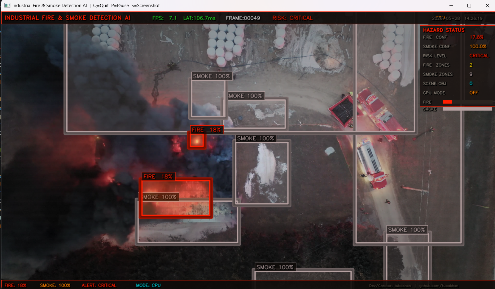

# 🚀 Industrial Computer Vision Systems

Production-style industrial AI perception systems built using YOLOv8, OpenCV, PyTorch, and advanced real-time computer vision pipelines.

---

# 🔥 Projects Included

## 1️⃣ Smart Crowd Panic Detection System

AI-powered surveillance system for:

- Crowd monitoring
- Panic detection
- Motion analysis
- Heatmap generation
- Risk scoring
- Real-time anomaly detection

### 📸 Demo


---

## 2️⃣ Industrial Fire & Smoke Detection System

Industrial hazard monitoring system featuring:

- Fire detection
- Smoke analysis
- Hazard classification
- Safety zone visualization
- Real-time industrial alerts

### 📸 Demo


---

## 3️⃣ ADAS Perception Pipeline

Autonomous driving perception stack with:

- Lane detection
- Vehicle detection
- Object tracking
- Collision risk analysis
- Bird’s-eye-view visualization
- Autonomous driving HUD

### 📸 Demo


---

# 🛠 Tech Stack

- Python
- YOLOv8
- OpenCV
- PyTorch
- NumPy
- Supervision
- MiDaS
- ByteTrack

---

# ✨ Features

✅ Real-time industrial AI systems  
✅ Cinematic HUD overlays  
✅ Multi-object tracking  
✅ Heatmaps & analytics  
✅ Autonomous driving perception  
✅ Industrial hazard monitoring  
✅ Crowd intelligence systems  
✅ GPU acceleration support  

---

# 📂 Repository Structure

```bash
Industrial-Computer-Vision-Systems/
├── Autonomous Driving System/
├── Industrial Fire & Smoke Detection System/
├── Smart Crowd Panic Detection System/
├── screenshots/
├── demo-videos/
└── README.md
```

---

# ⚠️ Disclaimer

This repository is intended for educational and research purposes only.