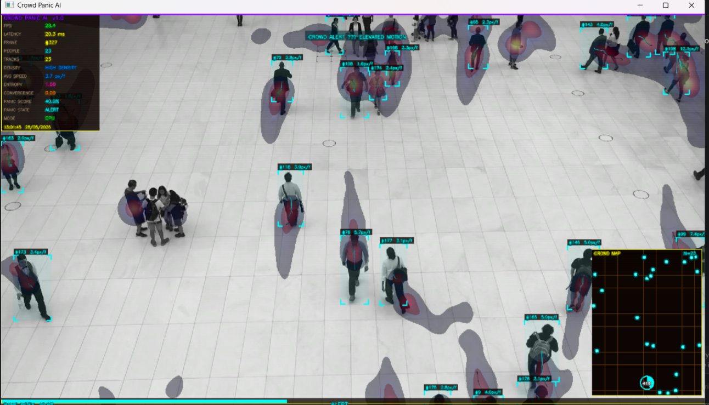
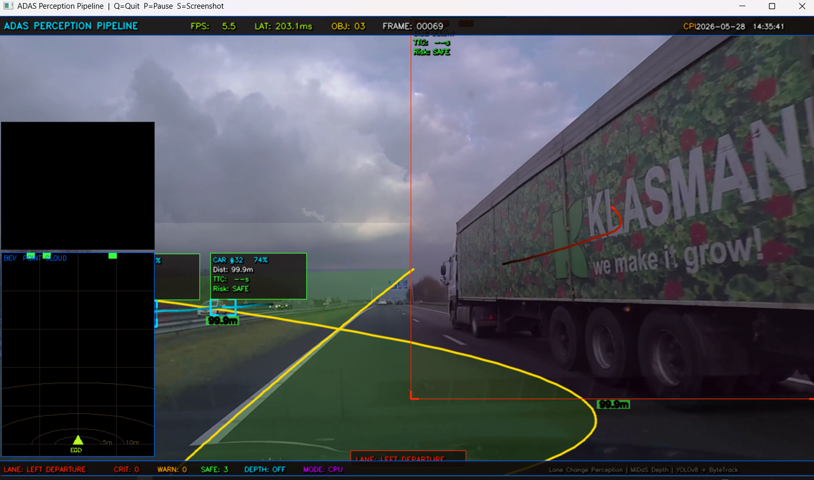

# 🚀 Industrial Computer Vision Systems

Production-style industrial AI perception systems built using YOLOv8, OpenCV, PyTorch, and advanced real-time computer vision pipelines.
## 🔥 Projects Included

### 1. Smart Crowd Panic Detection System
AI-powered surveillance system for:
- Crowd monitoring
- Panic detection
- Motion analysis
- Heatmap generation
- Risk scoring

### 2. Industrial Fire & Smoke Detection System
Industrial hazard monitoring system featuring:
- Fire detection
- Smoke analysis
- Safety zone visualization
- Real-time alerts

### 3. ADAS Perception Pipeline
=======
---

# 🔥 Projects Included

## 1️⃣ Smart Crowd Panic Detection System

AI-powered surveillance system for:
- Crowd monitoring
- Panic detection
- Motion analysis
- Heatmap generation
- Risk scoring
- Real-time anomaly detection

### 📸 Demo


---

## 2️⃣ Industrial Fire & Smoke Detection System

Industrial hazard monitoring system featuring:
- Fire detection
- Smoke analysis
- Hazard classification
- Safety zone visualization
- Real-time industrial alerts

### 📸 Demo


---

## 3️⃣ ADAS Perception Pipeline

>>>>>>> 9728338 (Organized screenshots and demo assets)
Autonomous driving perception stack with:
- Lane detection
- Vehicle detection
- Object tracking
<<<<<<< HEAD
- Depth estimation
- Collision risk analysis

---

## 🛠 Tech Stack
=======
- Collision risk analysis
- Bird’s-eye-view visualization
- Autonomous driving HUD

### 📸 Demo


---

# 🛠 Tech Stack
>>>>>>> 9728338 (Organized screenshots and demo assets)

- Python
- YOLOv8
- OpenCV
- PyTorch
- NumPy
- Supervision
- MiDaS
<<<<<<< HEAD
- Streamlit

---

## 📸 Project Screenshots

### Crowd Panic Detection


### Fire & Smoke Detection


### ADAS System


---

## 🎯 Features

✅ Real-time AI pipelines  
✅ Industrial surveillance systems  
✅ Heatmaps & analytics  
✅ GPU acceleration support  
✅ Motion tracking  
✅ Cinematic HUD overlays  
✅ Autonomous driving perception  

---

## ⚠️ Disclaimer

This repository is intended for educational and research purposes only.
=======
- ByteTrack

---

# ✨ Features

✅ Real-time industrial AI systems  
✅ Cinematic HUD overlays  
✅ Multi-object tracking  
✅ Heatmaps & analytics  
✅ Autonomous driving perception  
✅ Industrial hazard monitoring  
✅ Crowd intelligence systems  
✅ GPU acceleration support  

---

# 📂 Repository Structure

```bash
Industrial-Computer-Vision-Systems/
├── Autonomous Driving System/
├── Industrial Fire & Smoke Detection System/
├── Smart Crowd Panic Detection System/
├── screenshots/
├── demo-videos/
└── README.md
```

---

# ⚠️ Disclaimer

This repository is intended for educational and research purposes only.
>>>>>>> 9728338 (Organized screenshots and demo assets)
